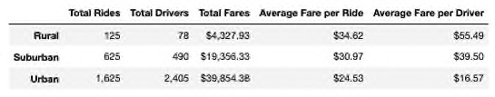
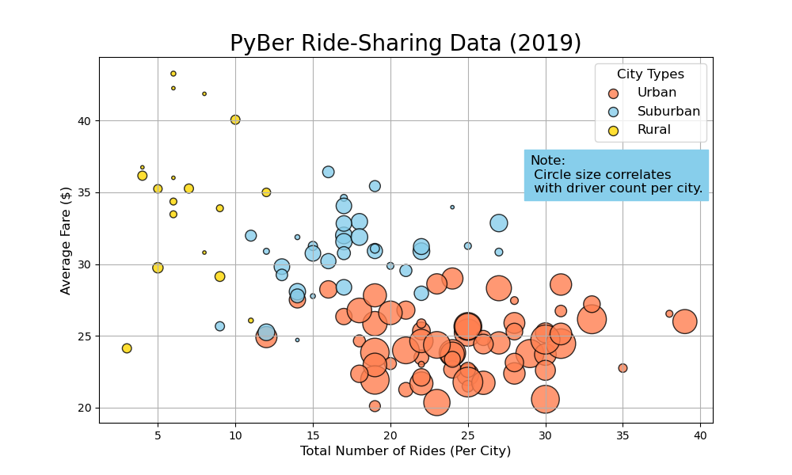
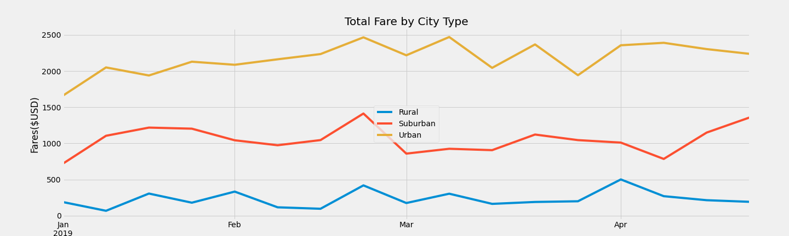

# PyBer Analysis of 2019 Rideshare Data

## Overview of Analysis
The CEO of PyBer, V. Isuualize, requested an analysis of the company's ride-share data starting in January through early May of the year 2019. This data will be used to help improve access to ride-sharing services and determine affordability for underserved neighborhoods.

To help with the visualizations, this project used Matplotlib and Jupyter Notebook to create the charts that are used in this analysis. The charts presented show the various relationships between city types and other data such as the number of riders, drivers, and fares.

The results of the analysis will be covered first followed by a summary of recommendations based on the results of this analysis.

## Results

There are 3 distinct city types included in PyBer's data: Urban, Suburban, and Rural. The datasets from these different types of cities vary greatly when comparing one against the other. This section contains several tables and charts showing these relationships.

The results are divided into the following sections to show the differences between the 3 different city types for these Ride-sharing metrics:
- Total Rides
- Total Drivers
- Total Fares
- Average Fare per Ride 
- Average Fare per Driver
- Total Weekly Fares by City Type

Before analysis, the 2 input files, city_data.csv and ride_data.csv were read in and merged to create a summary dataframe to analyze various stats such as Total Drivers and sum of all Fares for each city type.  Later this data was used to display more complicated relationships using a multi-line chart to get a better understanding of how the stats were affected by the different types of cities.

The Pyber Summary dataframe can be seen here: 

From the above image we can see the number of Total Rides and Total Drivers, the Sum of all the Fares, the Average Fare per Ride and the Average Fare per Driver. The values for these metrics have been broken down into 3 categories based on the type of city Rural, Suburban and Urban. 

The bubble chart below shows the relationship between the number of rides, number of drivers and the average fares per ride depending on the type of city:

### Total Rides

In the bubble chart shown above we can see how most of the urban cities have the greatest number of rides as most of their datapoints are above 15 total rides. For most suburban cities, total rides fall between 10 and 25 and for rural ones they most are between 5 and 10 rides per city.  The following column from the table above shows the breakdown of total rides followed by a pie chart showing the percentages by city type and confirms the observations in the bubble chart:

| City Type | Total Rides |
|:---       |         ---:| 
| Rural     |     125     |
| Suburban  |     625     |
| Urban     |   1,625     |

 

Rural areas have a lot less people spread out than more densely populated urban areas. This logistical difference may play into the large difference of 125 vs 1,1625 rides in rural cities vs. urban ones. In most rural areas almost everyone has their own car for transportation so it is also a lot less likely that someone is in need of transportation from an outside source. When they do need a car they may be calling on neighbors and family to borrow one or to hitch a ride. This may be an opportunity to look into to see if people in rural areas tend to rely on someone else rather than reaching out to a mobile app service such as PyBer. ***

Similar to rural areas, suburban cities also had a relatively low amount of riders compared to urban areas. Again, most people in these areas own one or more vehicles so even if one is not available they have another to use instead in many cases.

We see a similar trend in the pie chart. Rural cities only make up 5.3% of the ride total while suburbs make up 26.3% and urban areas 68.4%.

### Total Drivers

The following table shows the breakdown for total drivers by city type:

| City Type | Total Drivers |
|:---       |           ---:| 
| Rural     |        78     |
| Suburban  |       490     |
| Urban     |     2,405     |

Previously, we noted that both rural and suburban cities have significantly less rides than urban areas. It stands to reason that with less rides there would be less drivers as well and this data seems to correlate in a way to confirm that observation.

From the pie chart we can see that rural cities make up a mere 2.6% of the driver pool. Suburban cities have almost 16.5% and and urban cities make up more than 80% of the drivers at PyBer:

In the bubble chart we see a similar result. The bubbles in the chart are much larger and in a greater number for Urban cities over suburban and rural ones:

### Total Fares

The following table shows the breakdown for total fares for each city type:
| City Type | Total Fares |
|:---       |         ---:| 
| Rural     |  $4,327.93  |
| Suburban  | $19,356.33  |
| Urban     | $39,854.38  |

Above, we can see that rural cities collected almost 7% of the total fares during this period. Suburban cities collected approximately 31% and urban ones 63% of all the fares. This is very similar to both the difference in number of drivers and rides, however, urban areas only collected approximately 2 times the amount of fares than suburban cities where the number of drivers was close to 5 times greater. 

This implies that the cost per ride in urban areas is less than the suburbs which was observed in the bubble chart above as well.  Possibly, the fares in urban areas are too low for the number of rides and this may be something to consider for the future. ***

### Average Fare per Ride

The following table shows the breakdown of average fares of a ride in each type of city:
| City Type | Average Fare per Ride |
|:---       |                   ---:| 
| Rural     | $34.62                |
| Suburban  | $30.97                |
| Urban     | $24.53                |  

The summary bubble chart is included here with a focus on the "Average Fare($)" on the vertical axis with the "Total Number of Rides (Per City)" on the horizontal axis.

Looking at the number of bubbles and their placement on the x and y axis of the chart we can see that urban cities have a large concentration of rides in the lower right quadrant while rural areas tend to be more spread out around the mid to upper left half of the chart.  This implies that the average fares for urban rides are lower while the number of rides in these areas are greater than the fares and rides in rural areas. These differences are quite significant.

Note that for fares, both the average rural and suburban fares are greater than the average fares for most rides in urban cities.

### Average Fare per Driver

The following table shows the breakdown of average fares charged by a driver in each type of city:
| City Type | Average Fare per Driver |
|:---       |                     ---:| 
| Rural     | $55.49                  |
| Suburban  | $39.50                  |
| Urban     | $16.57                  |

For rural areas, most of the bubbles fall on the left side of the chart and most are above the $30 range, we can conclude that the fares for most of the rural drivers are significantly higher than those in urban cities in which almost all of the bubbles fall below the $30 average fare.

For suburban cities, the bubbles are almost all 2x larger than the rural ones and roughly 1/2 the size of Urban cities indicating that the number of drivers in the suburbs are in the middle range. The fares for most of the suburban drivers are in the $30 - $35 range while most of the urban fares fall in the $20 - $25 range. This is also a significant difference. Since suburban areas have quite a few more drivers than rural areas, this may be an area to look at when determining best fare prices for urban and suburban drivers. ***

### Total Weekly Fares by City Type

Finally, we will compare the total weekly fares by city type.  The image below shows a sum of the weekly fares earned in each type of city over the period starting on the first week of January through the last week of April 2019:

From this multi-line chart we can clearly see how suburban cities fall somewhat in the middle overall with fare earnings while urban cities are consistently the highest and rural areas the lowest overall.  

Some other observations with this chart show there is a peak in fare prices toward the end of February for all types of cities.

TODO: go back to see if there is anything that stands out during this week to indicate why there is a peak and if it matters.

Other notable peaks/dips by city type are as follows:

Total fares collected for urban cities seem to peak around the 4th week of February at 2.5K then fall and rise between the range of 2K - 2.5K for the entire week of March ending with a peak in the first week of April to flatten out around 2.4/2.3 K for the rest of April. These could correlate to spring break weeks in colleges first then grade schools during the weeks of March and April. ***

## Summary
TODO: Write a summary and include ideas above indicated by ***.

### Recommendation 1
TODO: rec 1

### Recommendation 2
TODO: rec 2

### Recommendation 3
TODO: rec 3

## Technical Notes
PyBer.ipynb: This is the original notebook created during the first stage of the analysis while completing the modules for this challenge. The code for the summary bubble chart and pie charts included in the notebook for this challenge were from this first notebook.

Pyber_Challenge.ipynb: This is the final analysis and includes the code for the summary chart and multi-line chart for this notebook.

analysis: This folder contains all the images for the first analysis and the final analysis for the challenge.

Resources: This folder contains all the input data for both phases of the PyBer data analysis.

