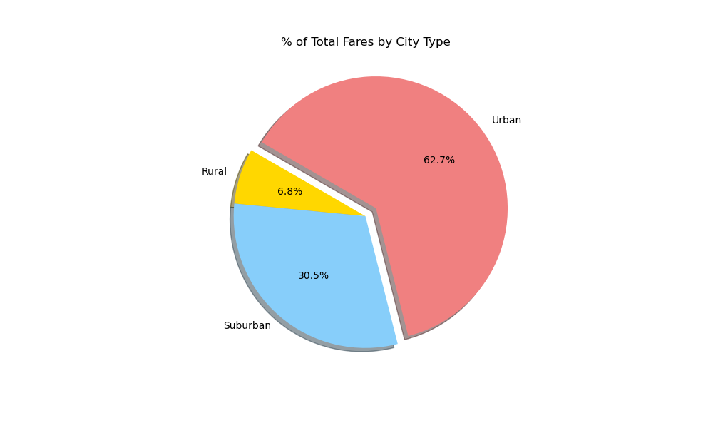

# PyBer Analysis of 2019 Rideshare Data

## Overview of Analysis
The CEO of PyBer, V. Isuualize, requested an analysis of the company's ride-share data starting in January through early May of the year 2019. This data will be used to help improve access to ride-sharing services and determine affordability for underserved neighborhoods.

To help with the visualizations, this project used Matplotlib and Jupyter Notebook to the charts that are used in this analysis. The charts presented show the various relationships between city types and other data such as the number of riders, drivers, and fares.

The results of the analysis will be covered first followed by a summary of recommendations based on the results of this analysis.

## Results

There are 3 distinct city types included in PyBer's data: Urban, Suburban, and Rural. The datasets from these different types of cities vary greatly when comparing one against the other. This section contains several tables showing these relationships.

The results are divided into the following sections to show the differences between the 3 different city types for these Ride-sharing metrics:
- Total Rides
- Total Drivers
- Total Fares
- Average Fare per Ride 
- Average Fare per Driver
- Total Weekly Fares by City Type

Before analysis, the 2 input files, city_data.csv and ride_data.csv were read in and merged to create a summary dataframe to analyze various stats such as Total Drivers and sum of all Fares for each city type.  Later this data was used to display more complicated relationships using a multi-line chart to get a better understanding of how the stats were affected by the different types of cities.

The Pyber Summary dataframe can be seen here: 

From the above image we can see the number of Total Rides and Total Drivers, the Sum of all the Fares, the Average Fare per Ride and the Average Fare per Driver. The values for these metrics have been broken down into 3 categories based on the type of city Rural, Suburban and Urban. 

### Total Rides

The following image shows the Percentage of total rides by city type

 
Rural areas have a lot less people spread out than more densely populated urban areas. This logistical difference may play into the large difference of 125 vs 1,1625 rides in rural cities vs. urban ones. In most rural areas almost everyone has their own car for transportation so it is also a lot less likely that someone is in need of transportation from an outside source. When they do need a car they may be calling on neighbors and family to borrow one or to hitch a ride. This may be an opportunity to look into to see if people in rural areas tend to rely on someone else rather than reaching out to a mobile app service such as PyBer.

Similar to rural areas, suburban cities also had a relatively low amount of riders compared to urban areas. Again, most people in these areas own one or more vehicles so even if one is not available they have another to use instead in many cases.

As we look at the total number of drivers and the total sum of the fares received in each type of city we will try to get a better idea of how Pyber can increase ridership in rural and suburban areas.

### Total Drivers

The following table shows the breakdown for total drivers by city type:
| City Type | Total Drivers |
|:---       |           ---:| 
| Rural     |        78     |
| Suburban  |       490     |
| Urban     |     2,405     |

A rough calculation shows that suburban cities have more than 5 times the number of drivers as rural cities and urban ones have over 25 times the number of drivers than urban ones.  Urban cities also have approximately 5 times the number of drivers than in the suburbs.

Previously, we noted that both rural and suburban cities have significantly less rides than urban areas. It stands to reason that with less rides there would be less drivers as well and this data seems to coorelate in a way to confirm that bias.

### Total Fares

The following table shows the breakdown for total fares for each city type:
| City Type | Total Fares |
|:---       |         ---:| 
| Rural     |  $4,327.93  |
| Suburban  | $19,356.33  |
| Urban     | $39,854.38  |

Above, we can see that suburban cities collected approximately 5 times more in fares during this period than rural cities. This is very similar to both the difference in number of drivers and rides, however, urban areas only collected approximately 2 times the amount of fares than suburban cities where the number of drivers was close to 5 times greater. This implies that the cost per ride in urban areas is less than the suburbs which we will see below as well.  Possibly, the fares in urban areas are too low for the number of rides 

### Average Fare per Ride

The following table shows the breakdown of average fares of a ride in each type of city:
| City Type | Average Fare per Ride |
|:---       |                   ---:| 
| Rural     | $34.62                |
| Suburban  | $30.97                |
| Urban     | $24.53                |  

### Average Fare per Driver

The following table shows the breakdown of average fares charged by a driver in each type of city:
| City Type | Average Fare per Driver |
|:---       |                     ---:| 
| Rural     | $55.49                  |
| Suburban  | $39.50                  |
| Urban     | $16.57                  |

### Total Weekly Fares by City Type

The image below shows a sum of the weekly fares earned in each type of city over the period starting on the first week of January through the last week of April 2019:

## Summary

### Recommendation 1
TODO: rec 1

### Recommendation 2
TODO: rec 2

### Recommendation 3
TODO: rec 3

